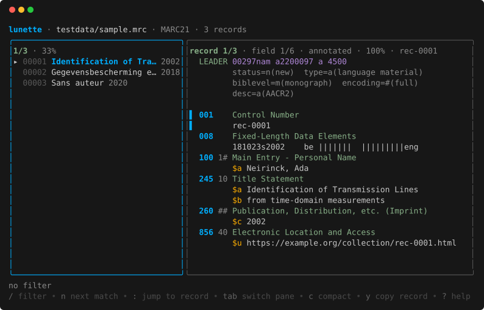
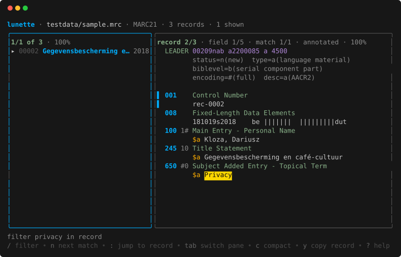
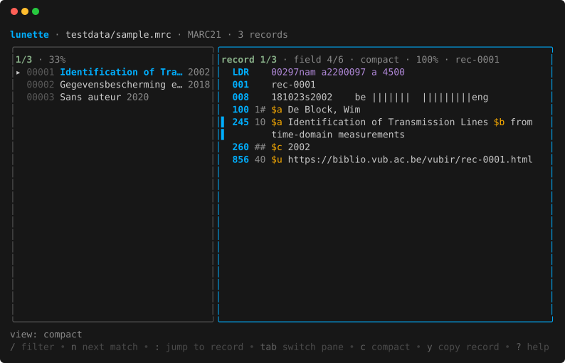

# lunette

A terminal browser for MARC21 files: record list on the left, record on the
right. Reads binary MARC21 and MARCXML, and converts between them.



## Install

```bash
go install github.com/beyto1974/lunette@latest    # needs Go 1.25.8 or newer
```

Or download a binary for linux, macOS or Windows, amd64 or arm64, from the
[releases](https://github.com/beyto1974/lunette/releases) — check it against
the `checksums.txt` published alongside. Or build it:

```bash
git clone https://github.com/beyto1974/lunette && cd lunette && make build
```

Nothing else is needed at runtime — it is one static binary.

## Browse

```bash
lunette records.mrc
lunette records.marcxml         # the format is detected, not assumed
lunette part-*.mrc              # several files read as one set
lunette -follow harvest.mrc     # keep reading while a harvest writes the file
```

| Key | |
|---|---|
| `↑` `↓` `j` `k` | Move: records in the list, fields in the record |
| `tab` `enter` | Switch pane · `z` one pane at a time |
| `/` | Filter · `s` cycles where it looks: titles, record, both |
| `n` `N` | Next, previous match |
| `:` | Jump to a record number |
| `a` `c` `r` `J` `X` | Annotated, compact, raw, JSON, XML |
| `f` | Filter by the selected field |
| `o` | Open the field's URL, or the record's 856 |
| `y` | Copy the field, or the whole record |
| `?` | All keys · `q` quit |

The mouse works too: click to select, scroll either pane.



## Command line

```bash
lunette validate records.mrc                       # exit 1 if a record fails to decode
lunette encoding records.mrc                       # what encoding the file really uses
lunette show -mode compact records.mrc             # print records
lunette show -scope record -filter privacy f.mrc   # search inside records, not just titles
lunette export -format xml records.mrc > out.xml   # mrc, xml or json
metha-cat -format marc21 "$URL" | lunette show -   # "-" is standard input
```

`show -mode` takes the same five views as the browser. Colour is on when
output is a terminal and off when it is piped; `-color`, `-no-color` and
`NO_COLOR` override that.



## Notes

- **Encodings.** Repositories often emit UTF-8 while leaving leader/09 blank,
  which claims MARC-8; read literally that turns `données` into `donn©♭es`.
  lunette trusts the bytes, says so in the title bar, and labels exports
  correctly. `lunette encoding` reports the evidence.
- **Damaged records** are reported with their offset, not skipped silently, and
  a record that would crash the parser is contained.
- **Untrusted input.** Control characters in a record are shown as `^[` rather
  than sent to the terminal, where they could rewrite the screen or reach the
  clipboard.
- **Dependencies.** MARC parsing is [gomarc](https://github.com/beyto1974/gomarc),
  which is pre-1.0 and may change under us; `make vuln` runs govulncheck, as
  does CI.

Longer explanations are in [docs/notes.md](docs/notes.md); planned work is in
[TODO.md](TODO.md) and [docs/ROADMAP.md](docs/ROADMAP.md); how to report a
vulnerability is in [SECURITY.md](SECURITY.md).

## Development

```bash
make test          # also: race, cover, lint
make golden        # rewrite the TUI frame snapshots after a layout change
make screenshots   # regenerate the images above
make snapshot      # build the release archives without publishing
```

Releases are cut by pushing a tag: GoReleaser builds the four binaries, stamps
the version into `lunette version`, and publishes archives and checksums.

Built on [gomarc](https://github.com/beyto1974/gomarc) and the
[Charm](https://charm.sh) stack.

## Licence

MIT — see [LICENSE](LICENSE).
